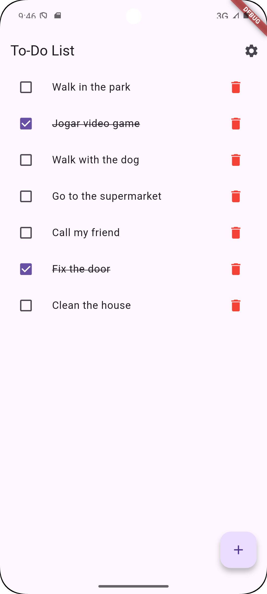
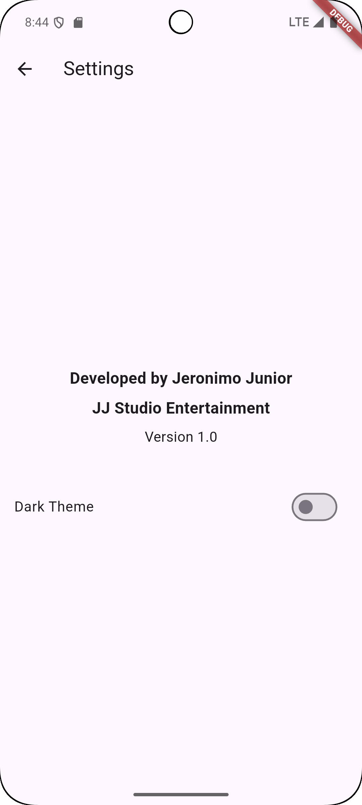
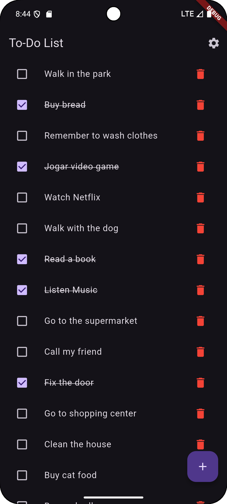

# To-Do List Flutter App 📝

Welcome to the **To-Do List Flutter App**, a feature-rich and user-friendly task management application designed to help you organize your tasks efficiently. Built with Flutter, this app is optimized for both iOS and Android devices, offering a seamless experience across platforms.

---

## Features 🌟

### 1. **Task Management**
- Add tasks with a simple and intuitive interface.
- Mark tasks as completed with a single tap.
- Unmark completed tasks with a confirmation prompt for accuracy.
- Delete tasks with a confirmation dialog to avoid accidental deletions.

### 2. **Persistent Storage**
- All tasks are saved locally on the device using `shared_preferences`.
- Your task list is automatically restored when you reopen the app.

### 3. **Dark Theme Support**
- Switch between light and dark themes directly from the settings screen.
- Your theme preference is saved and applied automatically when you reopen the app.

### 4. **About Section**
- A dedicated "Settings" screen featuring:
   - Developer information: **"Developed by Jeronimo Junior"**.
   - App version: **"Version 1.0"**.
   - Button to choose between Light Theme and Dark Theme

---

## Screenshots 📸

| Main Screen                    | Settings Screen                      | Dark Theme                     |
|--------------------------------|---------------------------------------|--------------------------------|
|  |  |  |

---

## Tech Stack ⚙️

- **Flutter**: A powerful UI toolkit for building natively compiled applications for mobile, web, and desktop from a single codebase.
- **Dart**: The programming language behind Flutter, enabling fast and scalable app development.
- **Shared Preferences**: For local storage of tasks and theme preferences.

---

## Installation 🚀

Follow these steps to run the app locally:

1. **Clone the repository**:
   ```bash
   git clone https://github.com/jjsetech/To_Do_List_Flutter.git

2. **Navigate to the project directory**:
   ```bash
   cd To_Do_List_Flutter

3. **Install dependencies**:
   ```bash
   flutter pub get

4. **Run the app**:
   ```bash
   flutter run

## License 📄
Este projeto está licenciado sob a [MIT License](LICENSE).

Thank you for checking out the To-Do List Flutter App! 🌟